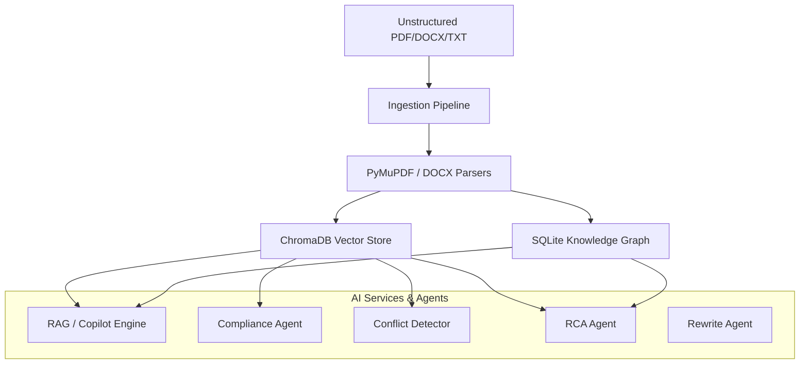
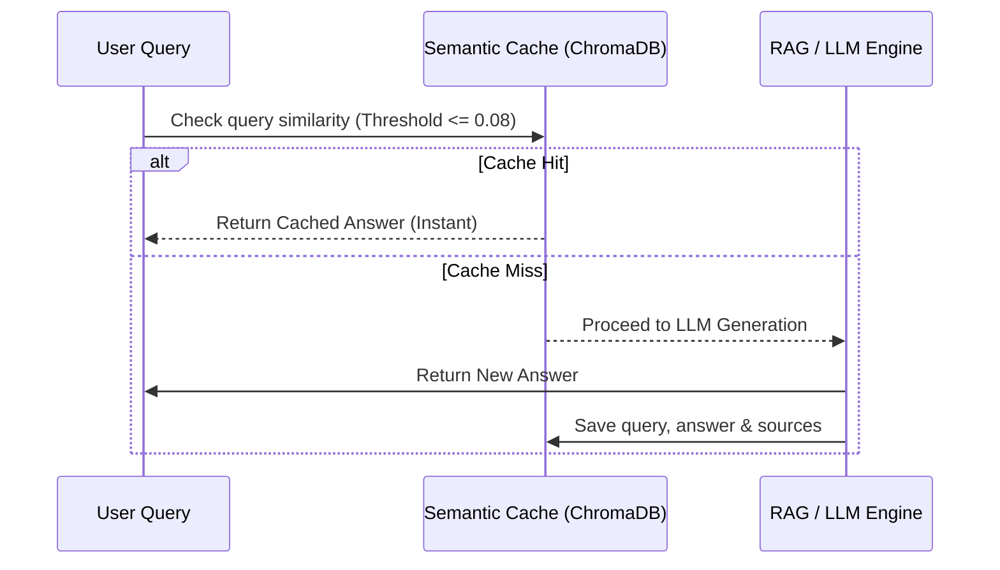
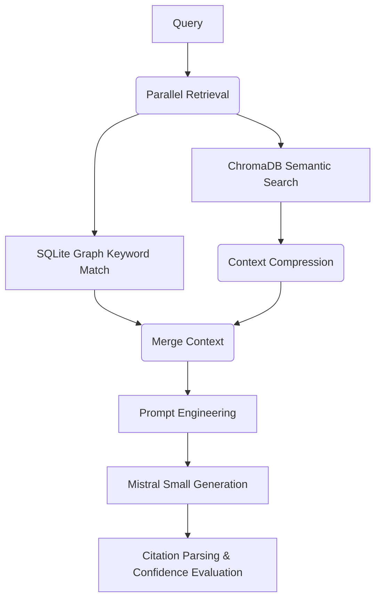

# Aethon — AI Architecture & Implementation Documentation

This document provides a comprehensive technical overview of the Artificial Intelligence (AI), Retrieval-Augmented Generation (RAG), and Multi-Agent subsystems powering the Aethon platform.

---

## 1. High-Level AI Architecture Overview
Aethon is an industrial intelligence platform that ingests unstructured technical documents (SOPs, OEM manuals, regulatory standards, work logs) and constructs a dual-representation knowledge base:
1.  **Vector Store (ChromaDB):** For dense semantic retrieval.
2.  **Knowledge Graph (SQLite):** For structured entity-relationship reasoning.

These representations are queried by a set of specialized RAG engines and autonomous agents.

---

## 2. Ingestion & Embedding Pipeline
Located in [embeddings.py](file:///c:/Desktop/Stand-Up/Projects/Aethon/backend/embeddings.py) and [ingest.py](file:///c:/Desktop/Stand-Up/Projects/Aethon/backend/ingest.py).

### Text Chunking & Extraction
*   Documents are parsed using PyMuPDF (PDF), python-docx (DOCX), or openpyxl (Excel).
*   Scanned pages trigger an automatic OCR fallback using **Tesseract OCR (`pytesseract`)**.
*   Texts are partitioned into semantic chunks of ~750 tokens with an 80-token overlap to maintain context boundaries.

### Embedding Generation
*   **Provider:** Mistral Embeddings (`mistral-embed`).
*   **Dimensions:** 1024-dimensional vectors.
*   **Robustness Subsystem (Recursive Sub-Batching):** 
    If a batch upload fails due to size limits or provider rate-limiting, the embedding client catches the error, waits with exponential backoff, and automatically slices the batch in half recursively to guarantee successful ingestion.
*   **Dimension Mismatch Safeguard:** 
    If ChromaDB encounters a vector dimension mismatch (e.g. switching from OpenAI to Mistral), the ingestion client catches the error, deletes the mismatched collection, and recreates it dynamically.

---

## 3. Semantic Cache Subsystem
Located in [embeddings.py](file:///c:/Desktop/Stand-Up/Projects/Aethon/backend/embeddings.py).

To bypass slow LLM latency and reduce API costs, Aethon features a dense semantic cache collection (`semantic_cache`) in ChromaDB:
1.  On receiving a query, it computes the query embedding and performs a vector search in the cache collection.
2.  **Distance Threshold:** It matches queries using a Cosine Distance threshold of **`0.08`** (equivalent to ~92% semantic similarity).
3.  If the distance is within the threshold, it serves the cached answer instantly, bypassing LLM generation.
4.  On cache misses, the generated RAG answer, sources, and confidence are saved back to the cache.

---

## 4. LLM Reranker Subsystem
Located in [embeddings.py](file:///c:/Desktop/Stand-Up/Projects/Aethon/backend/embeddings.py).

Standard vector search can return boilerplate headers or irrelevant matches. To ensure high-quality context, Aethon runs a two-stage retrieval:
1.  **Stage 1 (Retrieve):** Fetches the top `2 * k` candidate chunks using cosine similarity.
2.  **Stage 2 (Rerank):** Presents candidates to the LLM (`mistral-small-latest`) with a specialized prompt to score each chunk from 0 to 100 based on exact relevance.
3.  The chunks are re-sorted by their LLM scores, and only the top `k` are fed to the generation context.
4.  **Graceful Fallback:** If the LLM reranker fails (due to rate limits), the system falls back to vector similarity scores without crashing.

---

## 5. Knowledge Graph Construction
Located in [graph.py](file:///c:/Desktop/Stand-Up/Projects/Aethon/backend/graph.py).

During document ingestion, Aethon builds an SQLite-backed knowledge graph of industrial concepts:
*   **LLM Extraction:** For each page, a subset of chunks is presented to the LLM with a request for structured JSON output (`response_format={"type": "json_object"}`).
*   **Entities:** Extracts nodes (e.g. `Equipment`, `Parameter`, `Standard`, `Action`) with labels.
*   **Relationships:** Extracts edges (e.g. `lubricates`, `specifies`, `triggers`) between nodes.
*   **Concurrency:** Extraction is parallelized using a `ThreadPoolExecutor` (5 concurrent workers) to ensure high throughput during seeding.

---

## 6. The Core RAG Engine
Located in [rag.py](file:///c:/Desktop/Stand-Up/Projects/Aethon/backend/rag.py).

The RAG engine handles answering user queries through several steps:
1.  **Parallel Retrieval:** Concurrently queries ChromaDB for semantic chunks and queries SQLite for keyword-matched graph entities/relationships.
2.  **Context Compression:** Scores sentences within chunks based on query keyword overlap to filter out boilerplate noise, packing maximum information into the LLM context window.
3.  **Prompt Engineering:** Formats instructions forcing the LLM to write answers backed strictly by the provided context and cite them using `[DOC:filename]` format.
4.  **Citation Parsing:** Post-processes the LLM's response to extract and map citations to the source file name, page number, and text snippet.
5.  **Confidence Evaluation:** Evaluates RAG confidence dynamically based on the cosine distance of the retrieved chunks.

---

## 7. The 4 Intelligence Agents
Located in [agents.py](file:///c:/Desktop/Stand-Up/Projects/Aethon/backend/agents.py).

### Compliance Agent (`compliance_audit`)
Evaluates plant procedures against standard acts (Factory Act, OISD-116, DGMS, PESO). It retrieves regulatory standards, compares them with local procedures, and returns compliance ratings and gaps in a structured JSON schema.

### Conflict Detector Agent (`detect_conflicts`)
Cross-references different manuals and SOPs to detect numeric contradictions (e.g. differing lubrication intervals or operating thresholds). Uses an increased limit of **1024 tokens** to prevent JSON truncation.

### RCA Agent (`root_cause_analysis`)
Performs root cause analyses on equipment failures. It queries semantic work order logs, retrieves related knowledge graph contexts, and uses the LLM to generate engineering explanations along with estimated confidence.

### Rewrite Agent (`generate_rewrite`)
Generates compliant, precise text revisions to replace non-compliant SOP clauses or resolve detected contradictions.

### Fail-Safe Cache Resilience
All agents wrap LLM calls in a try-except block. If the API is rate-limited or unreachable, it falls back to an in-memory cache, and then to a disk cache (`data/compliance_cache.json`), ensuring the dashboard never blanks out.
